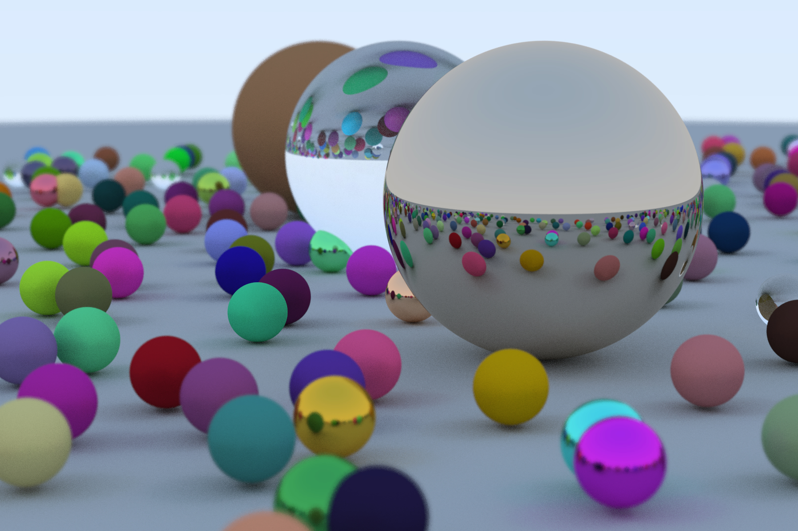

## Description

This code was implemented following the book [_Ray Tracing in One
Weekend_](https://raytracing.github.io/books/RayTracingInOneWeekend.html).  I would
definitely recomend to anyone interested.

## Benchmarks

### Test 1

```
Config:
=======
[+] simple multi-threaded
[-] multi-threaded hit detection

cargo run --release > img.jpg  371.14s user 1.86s system 297% cpu 2:05.52 total
```

### Test 2

```
Config:
=======
[+] simple multi-threaded
[+] multi-threaded hit detection

cargo run --release > img.jpg  1343.27s user 6.97s system 350% cpu 6:25.50 total
```

### Test 3

```
Config:
=======
[+] multi-threaded
[-] multi-threaded hit detection

cargo run --release > img.jpg  381.35s user 22.14s system 242% cpu 2:46.15 total
```

### Test 4

```
Config:
=======
[+] multi-threaded
[+] optimizations
[-] multi-threaded hit detection

cargo run --release > img.jpg  370.62s user 1.69s system 348% cpu 1:46.87 total
```

## Result


